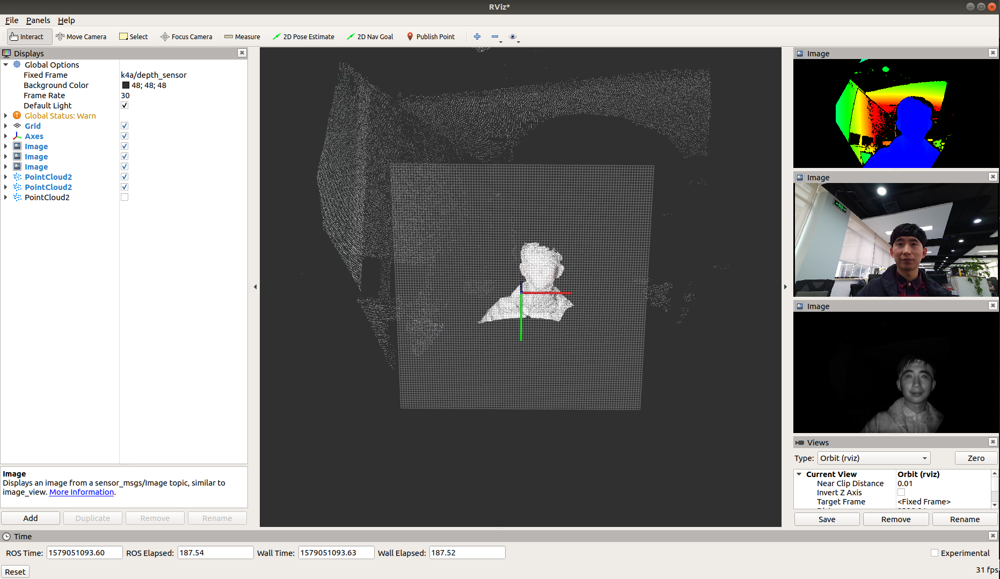

### Overview
This repository holds code of a [ROS](http://www.ros.org) package for data acquisition(color image, depth map and point cloud) with  [Kinect 4 Azure(https://azure.microsoft.com/en-us/services/kinect-dk/). It is basically a ROS wrapper of the low-level API provided by [Microsoft/Azure-Kinect-Sensor-SDK](https://microsoft.github.io/Azure-Kinect-Sensor-SDK/master/index.html), the manufacturer of the camera.



### Dependencies
The package has been tested with the following dependencies:
* Ubuntu 18.04
* CMake version 3.10.2
* gcc version 7.4.0
* [ROS Melodic](http://wiki.ros.org/melodic/Installation/Ubuntu)
* [Point Cloud Library v1.8](http://www.pointclouds.org/) (shipped with ROS Melodic)
* Azure-Kinect-Sensor-SDK(https://github.com/Microsoft/Azure-Kinect-Sensor-SDK)

### Download
```shell
$ git clone https://github.com/ZiqiChai/k4a-ros
```

### Build
```shell
$ catkin_make
```

### Execute

1. Plug your camera correctly, in terms of power and signal
2. Call the launch file.
```shell
$ roslaunch k4a-ros k4a_ros_node.launch
```
3. Or just run the ros node without rviz
```shell
$ rosrun k4a-ros k4a_ros_node
```


### Topic
1. "k4a/color/color": color image (Frame is color sensor, format is bgr8)
2. "k4a/color/color_to_depth": color image, aligned to depth map (Frame is depth sensor, format is bgr8)

3. "k4a/depth/depth": depth map (Frame is depth sensor, format is original 16UC1)
4. "k4a/depth/depth_colorized": colorized depth map (Frame is depth sensor, format is bgra8)
5. "k4a/depth/depth_to_color": depth map, aligned to color image (Frame is color sensor, format is original 16UC1)
6. "k4a/depth/depth_to_color_colorized": colorized depth map, aligned to color image (Frame is color sensor, format is bgra8)

7. "k4a/ir_image": ir image (Frame is depth sensor, format is original 16UC1)

8. "k4a/point_cloud/point_cloud_depth_to_depth": PCL point cloud with PointXYZ, this is converted from original depth map. (Frame is depth sensor, unit is millimeter)
9. "k4a/point_cloud/point_cloud_color_to_depth": PCL point cloud with PointXYZRGB, this is converted by aligning color image to original depth map.(Frame is depth sensor, unit is millimeter)
10. "k4a/point_cloud/point_cloud_depth_to_color": PCL point cloud with PointXYZRGB, this is converted by aligning depth map to original color image .(Frame is color sensor, unit is millimeter)


## References
* KinectAzureDKProgramming

  https://github.com/forestsen/KinectAzureDKProgramming

* Kinect2Grabber

  https://github.com/UnaNancyOwen/KinectGrabber

* Kinect Azure DK SDK

  https://github.com/microsoft/Azure-Kinect-Sensor-SDK
